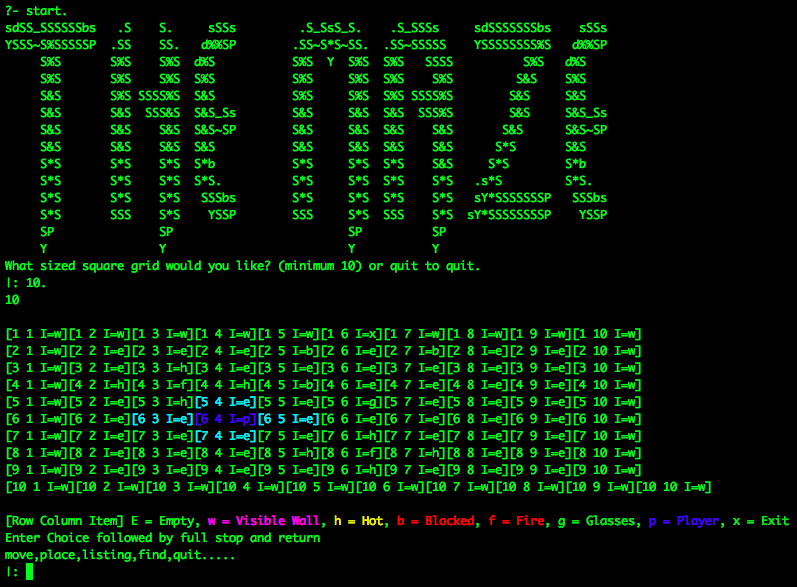
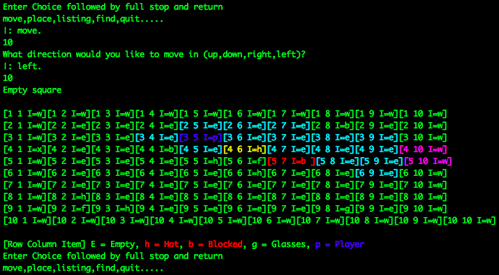
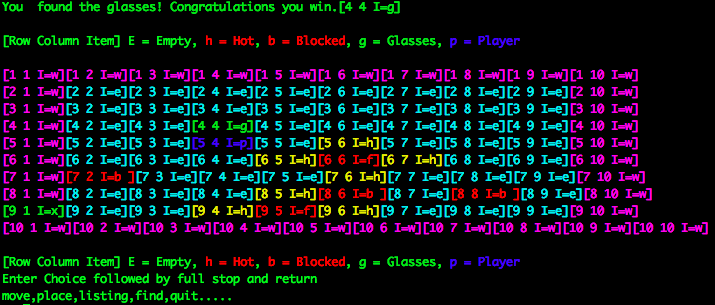

# The Maze
```
sdSS_SSSSSSbs   .S    S.     sSSs         .S_SsS_S.    .S_SSSs     sdSSSSSSSbs    sSSs  '),
YSSS~S%SSSSSP  .SS    SS.   d%%SP        .SS~S*S~SS.  .SS~SSSSS    YSSSSSSSS%S   d%%SP  '),
     S%S       S%S    S%S  d%S           S%S  Y  S%S  S%S   SSSS          S%S   d%S     '),
     S%S       S%S    S%S  S%S           S%S     S%S  S%S    S%S         S&S    S%S     '),
     S&S       S%S SSSS%S  S&S           S%S     S%S  S%S SSSS%S        S&S     S&S     '),
     S&S       S&S  SSS&S  S&S_Ss        S&S     S&S  S&S  SSS%S        S&S     S&S_Ss  '),
     S&S       S&S    S&S  S&S~SP        S&S     S&S  S&S    S&S       S&S      S&S~SP  '),
     S&S       S&S    S&S  S&S           S&S     S&S  S&S    S&S      S*S       S&S     '),
     S*S       S*S    S*S  S*b           S*S     S*S  S*S    S&S     S*S        S*b     '),
     S*S       S*S    S*S  S*S.          S*S     S*S  S*S    S*S   .s*S         S*S.    '),
     S*S       S*S    S*S   SSSbs        S*S     S*S  S*S    S*S   sY*SSSSSSSP   SSSbs  '),
     S*S       SSS    S*S    YSSP        SSS     S*S  SSS    S*S  sY*SSSSSSSSP    YSSP  '),
     SP               SP                         SP          SP			 '),
     Y                Y                          Y           Y                          '),
```

## Overview

Decided to publish some of my work from college to maybe help other students.
This is a project I did for an Artificial Intelligence assignment for my
honours degree in IT Sligo.

Its a game written in prologue in which a robot who has lost his/her glasses
tries to hunt for them in the dark. When you enter a square you can see your
adjacent squares and you have to avoid walls, blockers and firepits in order
to find your glasses.


## Getting started

Best way on mac is to use [homebrew](http://brew.sh/) in the terminal
```
brew install Caskroom/cask/swi-prolog
```

then the following command will start the compiler
```
swipl
```

and this command will load the game
```
['/{path-to-project}/the-maze/Main.pl'].
```

Finally to start the game just type
```
start.
```

> Alternatively the first 2 steps, especially for Windows users you can download
the [swi-prolog](http://www.swi-prolog.org/) standalone app, its a bit finicky
though.

## The game



